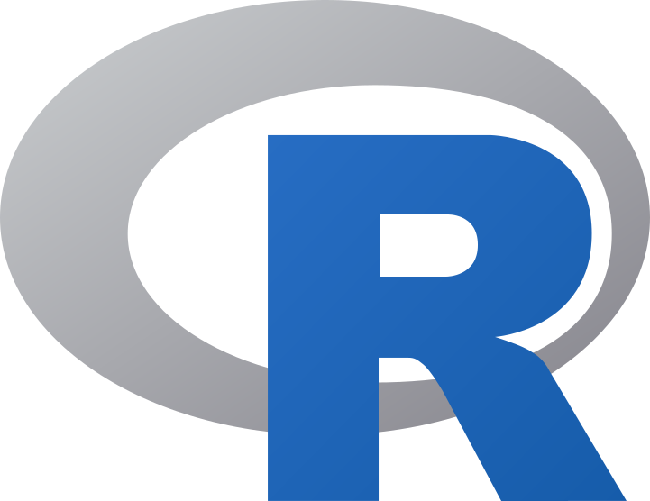
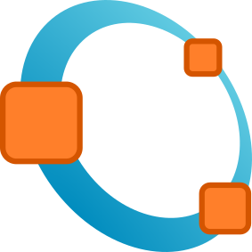

# Awesome BIDS 

A curated list of awesome BIDS projects, proposals, apps and resources

Make sure to also check repositories tagged for the following topics:

- [BIDS](https://github.com/topics/bids)
- [BIDS-Apps](https://github.com/topics/bidsapp)

## Contents

- [Apps](#apps)
- [Converters](#converters)
- [Documentation](#documentation)
- [Extension proposals](#extension-proposals)
- [Libraries](#libraries)

## Apps

BIDS apps are containerized tools to automatically process BIDS datasets.

BIDS Apps are also listed on [BIDS Apps](https://bids-apps.neuroimaging.io/apps/).

<!-- APP starts -->
-  [aa](https://github.com/bids-apps/aa): BIDS App containing an instance of the Automatic Analysis
-  [afni_proc](https://github.com/bids-apps/afni_proc): prototype AFNI bids app implementing participant level preprocessing with afni_proc.py
-  [antsCorticalThickness](https://github.com/bids-apps/antsCorticalThickness): BIDS App for calculating cortical thickness using ANTs
-  [baracus](https://github.com/bids-apps/baracus): Predicts brain age, based on data from Freesurfer 5.3
-  [brainiak-srm](https://github.com/bids-apps/brainiak-srm): This is the BIDS-app version of the Shared Response Model (SRM) of BrainIAK
-  [BrainSuite](https://github.com/bids-apps/BrainSuite): BrainSuite's structural, diffusion, and functional MRI processing pipelines with QC functionalities.
-  [BROCCOLI](https://github.com/bids-apps/BROCCOLI): BIDS App for BROCCOLI
-  [CPAC](https://github.com/bids-apps/CPAC): BIDS Application for the Configurable Pipeline for the Analysis of Connectomes (C-PAC)
-  [DPARSF](https://github.com/bids-apps/DPARSF): Docker version of DPARSF, also deployed at OpenNeuro.org
-  [freesurfer](https://github.com/bids-apps/freesurfer): BIDS app wrapping recon-all from FreeSurfer
-  [HCPPipelines](https://github.com/bids-apps/HCPPipelines): A BIDS App for minimal preprocessing using the HCP Pipelines
-  [hyperalignment](https://github.com/bids-apps/hyperalignment): Hyperalignment is a functional alignment method that aligns subjects' brain data in a high-dimensional space of voxels/features.
-  [mindboggle](https://github.com/bids-apps/mindboggle): Improve the accuracy, precision, and consistency of automated labeling and shape analysis of human brain image data
-  [MRtrix3_connectome](https://github.com/bids-apps/MRtrix3_connectome): Generate subject connectomes from raw BIDS data & perform inter-subject connection density normalisation, using  the MRtrix3 software package.
-  [ndmg](https://github.com/bids-apps/ndmg): BIDS app for NeuroData's MRI to Graphs pipeline
-  [nipypelines](https://github.com/bids-apps/nipypelines): Preprocess functional tasks in a BIDS dataset.
-  [oppni](https://github.com/bids-apps/oppni): runs fast optimization of preprocessing pipelines for BOLD fMRI
-  [PyMVPA](https://github.com/bids-apps/PyMVPA): runs MVPA and RSA analysis BIDS bold derivative data
-  [QAP](https://github.com/bids-apps/QAP): PCP Quality Assessment Protocol
-  [rs_signal_extract](https://github.com/bids-apps/rs_signal_extract): BIDS App for resting state signal extraction using nilearn.
-  [rsHRF](https://github.com/bids-apps/rsHRF): Resting state HRF estimation from BOLD-fMRI signal
-  [SPM](https://github.com/bids-apps/SPM): BIDS App containing an instance of the SPM software.
-  [tracula](https://github.com/bids-apps/tracula): implements Freesurfer's TRACULA (TRActs Constrained by UnderLying Anatomy) tool for cross-sectional as well as longitudinal (multi session) input data.
-  [connectomemapper3](https://github.com/connectomicslab/connectomemapper3): Connectome Mapper 3 is a BIDS App that implements full anatomical, diffusion, resting/state functional MRI, and recently EEG processing pipelines, from raw T1 / DWI / BOLD , and preprocessed EEG data to multi-resolution brain parcellation with corresponding connection matrices.
-  [bidsMReye](https://github.com/cpp-lln-lab/bidsMReye): BIDS app using deepMReye to decode eye motion for fMRI time series data.
-  [bidspm](https://github.com/cpp-lln-lab/bidspm): an SPM centric BIDS app
-  [fmriprep-fake](https://github.com/djarecka/fmriprep-fake): None
-  [funcmasker-flex](https://github.com/khanlab/funcmasker-flex): BIDS App for U-net brain masking of fetal bold MRI
-  [hippunfold](https://github.com/khanlab/hippunfold): BIDS App for Hippunfold (automated hippocampal unfolding and subfield segmentation)
-  [mialsuperresolutiontoolkit](https://github.com/Medical-Image-Analysis-Laboratory/mialsuperresolutiontoolkit): The Medical Image Analysis Laboratory Super-Resolution ToolKit (MIALSRTK) consists of a set of C++ and Python processing and workflow tools necessary to perform motion-robust super-resolution fetal MRI reconstruction in the BIDS Apps framework.
-  [micapipe](https://github.com/MICA-MNI/micapipe): micapipe from the Multimodal imaging and connectome analysis lab (http://mica-mni.github.io) at the Montreal Neurological Institute. Read The Docs documentation below
-  [dmriprep](https://github.com/nipreps/dmriprep): dMRIPrep is a robust and easy-to-use pipeline for preprocessing of diverse dMRI data. The transparent workflow dispenses of manual intervention, thereby ensuring the reproducibility of the results.
-  [fmriprep](https://github.com/nipreps/fmriprep): fMRIPrep is a robust and easy-to-use pipeline for preprocessing of diverse fMRI data. The transparent workflow dispenses of manual intervention, thereby ensuring the reproducibility of the results.
-  [mriqc](https://github.com/nipreps/mriqc): Automated Quality Control and visual reports for Quality Assessment of structural (T1w, T2w) and functional MRI of the brain
-  [nibabies](https://github.com/nipreps/nibabies): Processing tools for magnetic resonance images of infant brains
-  [nirodents](https://github.com/nipreps/nirodents): None
-  [smriprep](https://github.com/nipreps/smriprep): Structural MRI PREProcessing (sMRIPrep) workflows for NIPreps (NeuroImaging PREProcessing tools)
-  [BIDSonym](https://github.com/PeerHerholz/BIDSonym): a BIDS app for pseudo-anonymization of neuroimaging data
-  [babs_tests](https://github.com/PennLINC/babs_tests): Tests for BABS
-  [qsiprep](https://github.com/PennLINC/qsiprep): Preprocessing and reconstruction of diffusion MRI
-  [fitlins](https://github.com/poldracklab/fitlins): Fit Linear Models to BIDS Datasets
-  [multiscalebrainparcellator](https://github.com/sebastientourbier/multiscalebrainparcellator): Multi-Scale Brain Parcellator, part of the Connectome Mapping Toolkit (CMTK), is a BIDS App that implements a full anatomical MRI processing pipeline, from raw T1w data to structural brain parcellation at five different scales.
-  [gift-bids](https://github.com/trendscenter/gift-bids): None
<!-- APP ends -->

## Converters

Tools for converting data to/from BIDS from other standard or custom formats and layouts.

<!-- Converters starts -->

 ### MRI

-  [Autobids](https://github.com/khanlab/autobids): Automated Dicom to BIDS and pipelines using compute canada. From the Center for Functional and Metabolic Mapping (CFMM) at Western’s Robarts Research Institute.
  
-  [BIDScoin](https://bidscoin.readthedocs.io/en/stable/): BIDScoin converts your source-level neuroimaging data to BIDS
  
-  [BIDSconvertR](https://bidsconvertr.github.io/): The BIDSconvertR R package provides a user-friendly workflow with graphical user interfaces. It consists of the following steps: (i) convert DICOM data to NIfTI data using dcm2niix (ii) structure this data according to the BIDS specification (iii) provide the papayaWidget viewer for inspecting the images
  
-  [bidsify](https://github.com/NILAB-UvA/bidsify): Tool to convert source MRI datasets to BIDS-compatible datasets.
  
-  [bidskit](https://github.com/jmtyszka/bidskit/blob/master/docs/QuickStart.md): Utility functions for working with DICOM and BIDS neuroimaging data.
  
-  [BIDSme](https://gitlab.uliege.be/CyclotronResearchCentre/Public/bidstools/bidsme/bidsme_example/-/tree/master/example1):
  
-  [BMAT](https://github.com/ColinVDB/BMAT):
  
-  [BrkRaw](https://github.com/BrkRaw/brkraw): For a preclinical Bruker MRI scanner
  
-  [Clinica](https://aramislab.paris.inria.fr/clinica/docs/public/latest/):
  
-  [dac2bids](https://github.com/dangom/dac2bids): Create a BIDS structure for a DICOM folder.
  
-  [Data2Bids](https://github.com/SIMEXP/Data2Bids): Converts MRI files from extension supported by nibabel into NIfTI and convert them to BIDS
  
-  [Dcm2Bids](https://unfmontreal.github.io/Dcm2Bids/): converts DICOM files using dcm2niix into BIDS
  
-  [Explore ASL](https://exploreasl.github.io/Documentation/1.8.0/Tutorials-ASL-BIDS/): Convert DICOM and NIFTI data to the ASL-BIDS format.
  
-  [HeuDiConv](https://heudiconv.readthedocs.io/): A flexible DICOM converter for organizing brain imaging data into structured directory layouts
  
-  [Horos (Osirix) export plugin](https://github.com/mslw/horos-bids-output): Horos plugin for BIDS output.
  
-  [niix2bids](https://github.com/benoitberanger/niix2bids): Use this package as a command line to organize your Nifti dataset into BIDS.
  
-  [OpenfMRI2BIDS](https://github.com/bids-standard/openfmri2bids): Convert OpenfMRI dataset to BIDS
  
-   [PET2BIDS](https://github.com/openneuropet/PET2BIDS): Helps you convert your PET data! raw PET scanner files (for example ecat, dicom) and additional side file like excel sheets.
  
-  [ReproIn](https://github.com/ReproNim/reproin): HeuDiConv-based turnkey solution: a setup for automatic generation of shareable, version-controlled BIDS datasets from MR scanners.
  
-  [SAMRI](https://doi.org/10.3389/fninf.2020.00005): Full stack Small Animal MRI data analysis package, including the `bru2bids` repositing pipeline, which can convert Bruker archives to the BIDS format. From the ETH and University of Zurich, with collaboration from MIT and Dartmouth College.
  
-  [XNAT2BIDS](https://github.com/kamillipi/2bids): Simple xnat pipeline to convert DICOM scans to BIDS-compatible output (nii+json).
  

 ### MEEG

-  [BIDSme](https://gitlab.uliege.be/CyclotronResearchCentre/Public/bidstools/bidsme/bidsme_example/-/tree/master/example1):
  
-  [Biscuit](https://macquarie-meg-research.github.io/Biscuit/): GUI for easy MEG to BIDS conversion
  
-  [EEG2BIDS](None): A tool for converting raw EEG and iEEG data into the BIDS standard data structure, prepared for LORIS (Longitudinal Online Research and Imaging System).
  
-  [EEGLAB](https://eeglab.org/tutorials/04_Import/BIDS.html): <a href='https://github.com/arnodelorme/bids-MATLAB-tools'>See plugins</a>
  
-  [FieldTrip - data2bids](https://www.fieldtriptoolbox.org/example/bids/):
  
-  [MNE-BIDS](https://mne.tools/mne-bids): MNE-BIDS is a Python package that allows you to read and write BIDS-compatible datasets with the help of MNE-Python.
  
-  [sovabids](https://sovabids.readthedocs.io/en/latest/): A Python package for the automatic conversion of EEG datasets to the BIDS standard, with a focus on making the most out of metadata.
  

 ### physiological

-  [BIDScoin](https://bidscoin.readthedocs.io/en/stable/): BIDScoin converts your source-level neuroimaging data to BIDS
  
-  [bidsphysio](None): Converts physio data (CMRR, AcqKnowledge, Siemens PMU) to BIDS physiological recording
  
-  [phys2bids](https://phys2bids.readthedocs.io/en/latest/): Python3 library to format physiological files in BIDS.
  

 ### others

-  [convert-eprime](https://github.com/tsalo/convert-eprime): Python functions to convert E-Prime files to csvs. Not currently being developed.
  
-  [DCM2NIIx](https://github.com/neurolabusc/dcm2niix): dcm2nii DICOM to NIfTI converter
  
-  [DICM2NII](https://github.com/xiangruili/dicm2nii): dcm2nii DICOM to NIfTI converter
  
-  [sim2bids](https://github.com/dissagaliyeva/sim2bids): GUI to easily convert simulation results to BIDS format, according to <a herf="https://bids.neuroimaging.io/bep034" target="_blank">   BEP 34 </a>.
  
<!-- Converters ends -->

## Documentation

Documentation and publications related to BIDS.

- [BIDS Specification](https://bids-specification.readthedocs.io)
- [BIDS Starter Kit](https://bids-standard.github.io/bids-starter-kit/)
- [FieldTrip](https://www.fieldtriptoolbox.org/example/bids/) examples, mainly for MEG, EEG, fNIRS, etc.
- ...

## Extension proposals

Ongoing community proposals for extending the BIDS specification or interoperating with BIDS datasets.

<!-- BEP starts -->

 ### raw

- [BEP004](https://bids.neuroimaging.io/bep004): Susceptibility Weighted Imaging (SWI)
- [BEP020](https://bids.neuroimaging.io/bep020): Eye Tracking including Gaze Position and Pupil Size
- [BEP022](https://bids.neuroimaging.io/bep022): Magnetic Resonance Spectroscopy (MRS)
- [BEP024](https://bids.neuroimaging.io/bep024): Computed Tomography scan (CT)
- [BEP026](https://bids.neuroimaging.io/bep026): Microelectrode Recordings
- [BEP029](https://bids.neuroimaging.io/bep029): Virtual and physical motion data
- [BEP032](https://bids.neuroimaging.io/bep032): Animal electrophysiology
- [BEP033](https://bids.neuroimaging.io/bep033): Advanced Diffusion Weighted Imaging (aDWI)
- [BEP036](https://bids.neuroimaging.io/bep036): Phenotypic Data Guidelines
- [BEP037](https://bids.neuroimaging.io/bep037): Non-Invasive Brain Stimulation (NIBS)
- [BEP038](https://bids.neuroimaging.io/bep038): Atlases
- [BEP039](https://bids.neuroimaging.io/bep039): Dimensionality reduction-based networks
- [BEP040](https://bids.neuroimaging.io/bep040): Functional Ultrasound (fUS)

 ### derivative

- [BEP011](https://bids.neuroimaging.io/bep011): Structural preprocessing derivatives
- [BEP012](https://bids.neuroimaging.io/bep012): Functional preprocessing derivatives
- [BEP014](https://bids.neuroimaging.io/bep014): Affine transformations and nonlinear field warps
- [BEP016](https://bids.neuroimaging.io/bep016): Diffusion weighted imaging derivatives
- [BEP017](https://bids.neuroimaging.io/bep017): Generic BIDS connectivity data schema
- [BEP021](https://bids.neuroimaging.io/bep021): Common Electrophysiological Derivatives
- [BEP023](https://bids.neuroimaging.io/bep023): PET Preprocessing derivatives
- [BEP034](https://bids.neuroimaging.io/bep034): Computational modeling
- [BEP035](https://bids.neuroimaging.io/bep035): Modular extensions for individual participant data mega-analyses with non-compliant derivatives
<!-- BEP ends -->

## Software

Software packages for working with BIDS datasets.

<!-- TOOLS starts -->
-  [babs](https://pennlinc-babs.readthedocs.io/): BIDS App Bootstrap (BABS) is a reproducible, generalizable, and scalable Python package for BIDS App analysis of large datasets. It uses DataLad and adopts FAIRly big framework.  
-  [bids-cfood](https://gitlab.indiscale.com/caosdb/src/crawler-cfoods/bids-cfood): a module to handle BIDS dataset for the caosDB data crawler
-   [bids-matlab](https://github.com/bids-standard/bids-matlab): MATLAB/Octave tools to interact with datasets conforming to the BIDS format 
-  [BIDS-pydantic](https://github.com/gold-standard-phantoms/bids-pydantic): Pulls a specified version of the BIDS schema and creates corresponding Pydantic models, which will provide BIDS data validation using Python type annotations. See also [BIDS-pydantic-models](https://pypi.org/project/BIDS-pydantic-models/).  
-  [bids2cite](https://github.com/Remi-Gau/bids2cite): package to interactively update `dataset_description.json` and generate citation files (for example `datacite.yml`) for BIDS datasets. 
-  [bidser](https://bbuchsbaum.github.io/bidser/): Working with Brain Imaging Data Structure in R 
-  [BIDSHandler](https://github.com/Macquarie-MEG-Research/BIDSHandler): Python module allowing complete manipulation of BIDS data 
-  [Brainstorm](http://neuroimage.usc.edu/brainstorm/): MEG/EEG analysis package
-  [clpipe](https://clpipe.readthedocs.io/en/latest/index.html): streamlined processing pipeline for MRI data centered around BIDS 
-  [cuBIDS](https://cubids.readthedocs.io/en/latest/): a Python package designed to facilitate reproducible curation of neuroimaging BIDS datasets  
-  [GUI dataset description generator](None): GUI form that generates `dataset_description.json` 
-  [Lead-DBS](https://www.lead-dbs.org/): A toolbox facilitating Deep Brain Stimulation electrode reconstructions  and computer simulations supports BIDS conversion and ingestion of BIDS datasets.
-  [mne-bids](https://mne.tools/mne-bids/stable/index.html): collection of tools for converting magnetoencephalography (MEG) data into BIDS format, as well as some helper functions for creating the folders and metadata needed for a BIDS dataset. 
-  [OpenNeuro](http://openneuro.org): A free and open platform for validating and sharing BIDS-compliant data.
-  [PRFmodel](https://github.com/vistalab/PRFmodel/wiki): a set of tools to fit population receptive field models to BIDS datasets 
-  [PyBIDS](None): Python package to quickly parse / search the components of a BIDS dataset. It also contains functionality for running analyses on your data.  
-  [rbids](https://github.com/mathesong/rbids): aims to make BIDS datasets more easily accessible for packages written in R 
-   [spm_2_bids](https://spm-2-bids.readthedocs.io/en/latest/): a tool convert SPM preprocessed output to BIDS derivatives (trying to follow [BEP12](https://bids.neuroimaging.io/bep012)) 
<!-- TOOLS ends -->

## Contribute

Contributions welcome! Read the [contribution guidelines](contributing.md) first.
