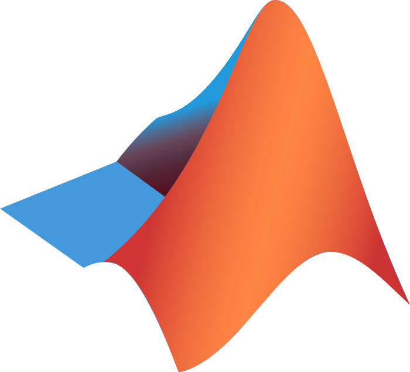
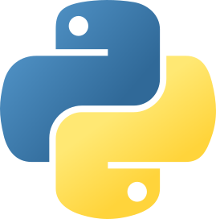

# Awesome BIDS 

A curated list of awesome projects, proposals, apps and resources
related to the Brain Imaging Data Structure.

## Documentation

Documentation related to BIDS.

- The central [BIDS website](http://www.bids-standard.org/) to get general information about BIDS.
- The [BIDS Starter Kit](https://bids-standard.github.io/bids-starter-kit/)
  is the best place to get started with BIDS.
- The official [BIDS Specification](https://bids-specification.readthedocs.io) to get into the details.
- The [BIDS youtube channel](https://www.youtube.com/channel/UCxZUcYfd_nvIVWAbzRB1tlw)
  where we try to curate [playlists](https://www.youtube.com/@brainimagingdatastructure6721/playlists) of BIDS related videos.
- Slides of many BIDS related presentations are available on the [Open Science Framework](https://osf.io/yn93h/).
- The [FieldTrip](https://www.fieldtriptoolbox.org/example/bids/) websites contains
  many BIDS  tips and  examples, mainly for MEG, EEG, fNIRS, etc.
- If you help to mention BIDS in one of your grant,
  make sure that to check out the [BIDS grant writing kit](https://github.com/bids-standard/grant_writing_kit#bids-grant-writing-kit).

## Community

- The [Neurostars discourse forum](https://neurostars.org/tag/bids)
  run by the International Neuroinformatics Coordinating Facility ([INCF](https://www.incf.org/))
  with its own [BIDS category](https://neurostars.org/tag/bids).
  With a lot BIDS users and developers,
  it is the best place where to ask BIDS related questions.

- [BIDS mailing list](https://groups.google.com/g/bids-discussion):
  a google group for announcements and discussions around BIDS.

- [BIDS in the Brainhack mattersmost](https://mattermost.brainhack.org/brainhack/channels/bids_general):
  [mattermost](https://mattermost.brainhack.org) is the open source equivalent of slack
  and the [Brainhack](https://brainhack.org/) instance has over 5000 members
  with its own channel dedicated BIDS channel.

## Social media

Here are the official BIDS account on several social media.

- [Twitter / X](https://twitter.com/BIDSstandard)
- [Mastodon](https://fosstodon.org/@bidsstandard/)
- [Bluesky](https://bsky.app/profile/bidsstandard.bsky.social)
- [YouTube](https://www.youtube.com/channel/UCxZUcYfd_nvIVWAbzRB1tlw)
- Our podcast on [anchor](https://anchor.fm/bids-maintenance)

## Datasets

- The [BIDS examples](https://bids-standard.github.io/bids-examples/) repository hosts dataset of each modality
  with empty raw data files. These datasets can be useful to:
  - serve as an example on how a BIDS dataset can be structured
  - write lightweight software tests
- [OpenNeuro](https://openneuro.org/) host more than 1000 open BIDS datasets of all datatypes.

## Converters

Tools for converting data to/from BIDS from other standard or custom formats and layouts.

<!-- Converters starts -->

### ASL

-   [Explore ASL](https://exploreasl.github.io/Documentation/1.8.0/Tutorials-ASL-BIDS/): Convert DICOM and NIFTI data to the ASL-BIDS format.
   
-   [ezBIDS](https://brainlife.io/docs/using_ezBIDS/): A web-based BIDS conversion tool with four unique features: (1) No installation or programming requirements. (2) Handling of both imaging and task events data and metadata. (3) Semi-automated inference and guidance for adherence to BIDS. (4) Multiple data management options, including download BIDS data to local system, or transfer to OpenNeuro.org or to brainlife.io.
   

### BIDS

-   [BIDS2ISATab](https://github.com/bids-standard/BIDS2ISATab): Extract ISA-Tab compatible metadata from BIDS
   
-   [BIDS2NDA](https://github.com/bids-standard/BIDS2NDA): Extract NIHM Data Archive compatible metadata from BIDS
   
-   [bids2xar - for XNAT import](https://github.com/lwallace23/bids2xar): Convert BIDS data set into XNAT XAR bundles
   

### EEG

-   [BIDSme](https://gitlab.uliege.be/CyclotronResearchCentre/Public/bidstools/bidsme/bidsme_example/-/tree/master/example1):
   
-   [EEG2BIDS](https://github.com/aces/EEG2BIDS): A tool for converting raw EEG and iEEG data into the BIDS standard data structure, prepared for LORIS (Longitudinal Online Research and Imaging System).
   
-   [EEGLAB](https://eeglab.org/tutorials/04_Import/BIDS.html): <a href='https://github.com/arnodelorme/bids-MATLAB-tools'>See plugins</a>
   
-   [FieldTrip - data2bids](https://www.fieldtriptoolbox.org/example/bids/):
   
-   [MNE-BIDS](https://mne.tools/mne-bids): MNE-BIDS is a Python package that allows you to read and write BIDS-compatible datasets with the help of MNE-Python.
   
-   [sovabids](https://sovabids.readthedocs.io/en/latest/): A Python package for the automatic conversion of EEG datasets to the BIDS standard, with a focus on making the most out of metadata.
   

### MEG

-   [Biscuit](https://macquarie-meg-research.github.io/Biscuit/): GUI for easy MEG to BIDS conversion
   
-   [EEGLAB](https://eeglab.org/tutorials/04_Import/BIDS.html): <a href='https://github.com/arnodelorme/bids-MATLAB-tools'>See plugins</a>
   
-   [FieldTrip - data2bids](https://www.fieldtriptoolbox.org/example/bids/):
   
-   [MNE-BIDS](https://mne.tools/mne-bids): MNE-BIDS is a Python package that allows you to read and write BIDS-compatible datasets with the help of MNE-Python.
   

### MISC

-   [convert-eprime](https://github.com/tsalo/convert-eprime): Python functions to convert E-Prime files to CSVs. Not currently being developed.
   
-   [sim2bids](https://github.com/dissagaliyeva/sim2bids): GUI to easily convert simulation results to BIDS format, according to <a href="https://bids.neuroimaging.io/bep034" target="_blank"> BEP 34 </a>.
   

### MRI

-   [BIDScoin](https://bidscoin.readthedocs.io/en/stable/): BIDScoin is a flexible tool to convert (“coin”) source-level (raw) neuroimaging data sets to BIDS without needing to code anything. It features automatic data discovery based on header as well as filesystem information, and comes with a user-friendly GUI to add missing information and tweak the results. BIDScoin supports multiple source data formats with plugins (e.g. employing dcm2niix, spec2nii or nibabel) and allows customization of the prior knowledge about your data (allowing for fully automatic CLI data conversion if you like).
   
-   [BIDSconvertR](https://bidsconvertr.github.io/): The BIDSconvertR R package provides a user-friendly workflow with graphical user interfaces. It consists of the following steps: (i) convert DICOM data to NIfTI data using dcm2niix (ii) structure this data according to the BIDS specification (iii) provide the papayaWidget viewer for inspecting the images
   
-   [bidskit](https://github.com/jmtyszka/bidskit/blob/master/docs/QuickStart.md): Utility functions for working with DICOM and BIDS neuroimaging data.
   
-   [BIDSme](https://gitlab.uliege.be/CyclotronResearchCentre/Public/bidstools/bidsme/bidsme_example/-/tree/master/example1):
   
-   [BMAT](https://github.com/ColinVDB/BMAT):
   
-   [BrkRaw](https://github.com/BrkRaw/brkraw): For a preclinical Bruker MRI scanner
   
-   [Clinica](https://aramislab.paris.inria.fr/clinica/docs/public/dev/):
   
-   [dac2bids](https://github.com/dangom/dac2bids): Create a BIDS structure for a DICOM folder.
   
-   [Data2Bids](https://github.com/SIMEXP/Data2Bids): Converts MRI files from extension supported by nibabel into NIfTI and convert them to BIDS
   
-   [Dcm2Bids](https://unfmontreal.github.io/Dcm2Bids/): converts DICOM files using dcm2niix into BIDS
   
-   [Explore ASL](https://exploreasl.github.io/Documentation/1.8.0/Tutorials-ASL-BIDS/): Convert DICOM and NIFTI data to the ASL-BIDS format.
   
-   [ezBIDS](https://brainlife.io/docs/using_ezBIDS/): A web-based BIDS conversion tool with four unique features: (1) No installation or programming requirements. (2) Handling of both imaging and task events data and metadata. (3) Semi-automated inference and guidance for adherence to BIDS. (4) Multiple data management options, including download BIDS data to local system, or transfer to OpenNeuro.org or to brainlife.io.
   
-   [FieldTrip - data2bids](https://www.fieldtriptoolbox.org/example/bids/):
   
-   [HeuDiConv](https://heudiconv.readthedocs.io/): A flexible DICOM converter for organizing brain imaging data into structured directory layouts
   
-  [Horos (Osirix) export plugin](https://github.com/mslw/horos-bids-output): Horos plugin for BIDS output.
   
-   [mercure-dcm2bids](https://github.com/mercure-imaging/mercure-dcm2bids): A containerized app that can be used to perform BIDS conversion of DICOM studies sent directly to mercure from a scanner or PACS. mercure is an open-source DICOM orchestration platform that can integrate containerized apps into clinical workflows. It has a graphical user interface making it easy to setup and manage BIDS configurations for multiple protocols. The Dcm2Bids tool is used for conversion.
   
-   [niix2bids](https://github.com/benoitberanger/niix2bids): Use this package as a command line to organize your Nifti dataset into BIDS.
   
-  [OpenfMRI2BIDS](https://github.com/bids-standard/openfmri2bids): Convert OpenfMRI dataset to BIDS
   
-   [ReproIn](https://github.com/ReproNim/reproin): HeuDiConv-based turnkey solution: a setup for automatic generation of shareable, version-controlled BIDS datasets from MR scanners.
   
-   [SAMRI](https://github.com/IBT-FMI/SAMRI): Full stack Small Animal MRI data analysis package, including the `bru2bids` repositing pipeline, which can convert Bruker archives to the BIDS format. From the ETH and University of Zurich, with collaboration from MIT and Dartmouth College.
   
-  [XNAT2BIDS](https://github.com/kamillipi/2bids): Simple xnat pipeline to convert DICOM scans to BIDS-compatible output (nii+json).
   

### NIRS

-   [MNE-BIDS](https://mne.tools/mne-bids): MNE-BIDS is a Python package that allows you to read and write BIDS-compatible datasets with the help of MNE-Python.
   

### PET

-   [BIDScoin](https://bidscoin.readthedocs.io/en/stable/): BIDScoin is a flexible tool to convert (“coin”) source-level (raw) neuroimaging data sets to BIDS without needing to code anything. It features automatic data discovery based on header as well as filesystem information, and comes with a user-friendly GUI to add missing information and tweak the results. BIDScoin supports multiple source data formats with plugins (e.g. employing dcm2niix, spec2nii or nibabel) and allows customization of the prior knowledge about your data (allowing for fully automatic CLI data conversion if you like).
   
-   [Clinica](https://aramislab.paris.inria.fr/clinica/docs/public/dev/):
   
-    [PET2BIDS](https://github.com/openneuropet/PET2BIDS): Helps you convert your PET data! raw PET scanner files (for example ecat, dicom) and additional side file like excel sheets.
   

### TSV

-   [BIDSto3col](https://github.com/bids-standard/bidsutils/tree/master/BIDSto3col): Reads BidsTSV and then creates 3 column event files, one per event type if a "trial_type" column is found.
   

### behavioral

-   [convert-eprime](https://github.com/tsalo/convert-eprime): Python functions to convert E-Prime files to CSVs. Not currently being developed.
   
-   [FieldTrip - data2bids](https://www.fieldtriptoolbox.org/example/bids/):
   

### computational model

-   [sim2bids](https://github.com/dissagaliyeva/sim2bids): GUI to easily convert simulation results to BIDS format, according to <a href="https://bids.neuroimaging.io/bep034" target="_blank"> BEP 34 </a>.
   

### events

-   [ezBIDS](https://brainlife.io/docs/using_ezBIDS/): A web-based BIDS conversion tool with four unique features: (1) No installation or programming requirements. (2) Handling of both imaging and task events data and metadata. (3) Semi-automated inference and guidance for adherence to BIDS. (4) Multiple data management options, including download BIDS data to local system, or transfer to OpenNeuro.org or to brainlife.io.
   

### iEEG

-   [FieldTrip - data2bids](https://www.fieldtriptoolbox.org/example/bids/):
   
-   [MNE-BIDS](https://mne.tools/mne-bids): MNE-BIDS is a Python package that allows you to read and write BIDS-compatible datasets with the help of MNE-Python.
   

### physiological

-   [BIDScoin](https://bidscoin.readthedocs.io/en/stable/): BIDScoin is a flexible tool to convert (“coin”) source-level (raw) neuroimaging data sets to BIDS without needing to code anything. It features automatic data discovery based on header as well as filesystem information, and comes with a user-friendly GUI to add missing information and tweak the results. BIDScoin supports multiple source data formats with plugins (e.g. employing dcm2niix, spec2nii or nibabel) and allows customization of the prior knowledge about your data (allowing for fully automatic CLI data conversion if you like).
   
-   [bidsphysio](None): Converts physio data to BIDS physiological recording
   
-   [phys2bids](https://phys2bids.readthedocs.io/en/latest/): Python3 library to format physiological files in BIDS.
   
